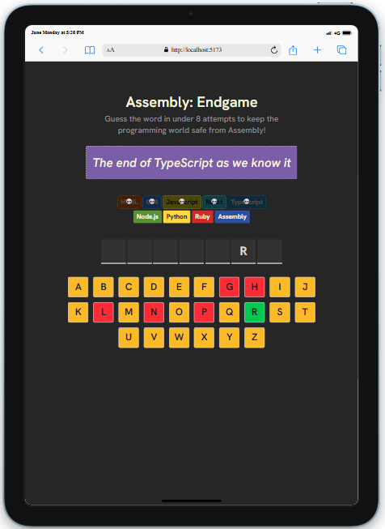

# 🧠 Assembly: Endgame

A Word Guessing Game

> _Guess the word in under 8 attempts to keep the programming world safe from Assembly!_

Each time you guess a wrong letter, one programming language vanishes from existence... Can you outsmart Assembly and save your favorite languages?

## 🚀 Demo

[🔗 Live Demo](https://assembly-endgame-v1.vercel.app/)

## Result

<table>
  <tr>
    <td></td>
    <td></td>
  </tr>
  <tr>
    <td></td>
    <td></td>
  </tr>
</table>

## 🎮 Gameplay

**Assembly: Endgame** is a fun, interactive word guessing game built with **React.js**. Inspired by Hangman, the twist is: you're battling Assembly itself. With every incorrect guess, a programming language is wiped out from the digital universe. Your mission: guess the hidden word before it's too late.

### 🕹️ How to Play

- You have **8 attempts** to guess the hidden word.
- Guess one letter at a time.
- Each incorrect guess causes one programming language to be "deleted."
- Win by revealing the full word before running out of attempts.
- Lose, and Assembly takes over... for now.

## ✨ Features

- ⚛️ Built with React.js
- 🎨 Sleek and responsive UI with TailwindCSS
- 🔄 Replayable with different words every round
- 💀 Unique "language deletion" animation for wrong guesses

## 📦 Installation

To run the game locally:

```bash
# Clone the repository
git clone https://github.com/Lil-Code30/assembly-endgame
cd assembly-endgame

# Install dependencies
npm install

# run the app
npm run dev
```
